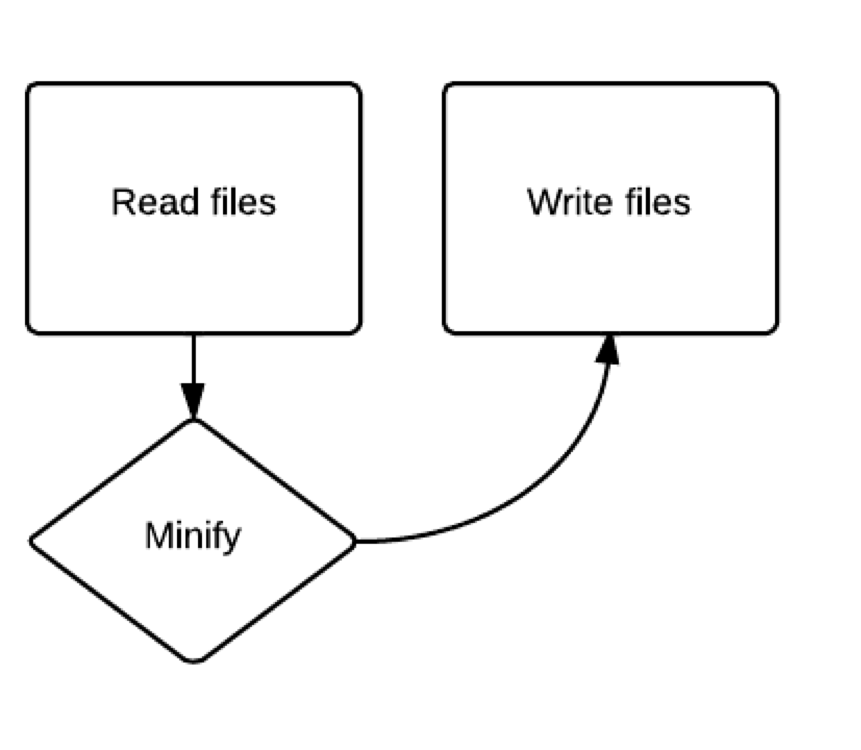
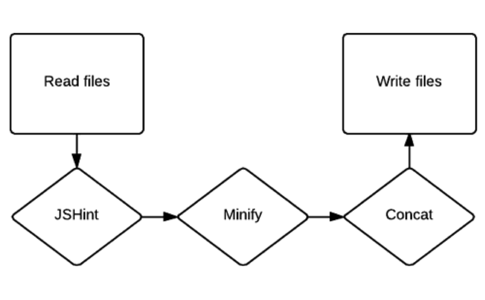
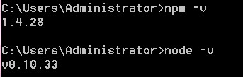
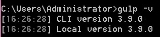

#Gulp使用指南
#### 说明：Gulp 是一款基于任务的前端自动化工具，通过插件来处理前端项目文件。如静态页面压缩、图片压缩、合并压缩JS、合并压缩CSS等。

###Gulp处理文件解析

###第一步：安装Node环境
可通过[NodeJS官网](https://nodejs.org/en/)下载安装包, 下载完成后运行安装程序。为确保Node是否安装正确，可通过以下命令检测：
- node -v
- npm -v

>  说明：看到下图所示的返回界面，则证明安装成功。
 

----------

###第二步：安装gulp
- 安装全局Gulp：npm install -g gulp   
- 安装局部Gulp:  npm install gulp --save-dev

> 安装完毕后，可运行gulp -v检测是否安装正确，若看到下图所示的返回界面，则证明安装成功。

----------

###第三步：选择Gulp组件

#####前端项目优化需求：
- 图片压缩（jpg/png/gif）  --gulp-imagemin/gulp-cache
- 样式编译合并与压缩         --gulp-sass/gulp-autoprefixer/gulp-minify-css
- JS语法检测合并与压缩     --gulp-jshint/gulp-concat/gulp-uglify
- HTML压缩                        --gulp-minify-html

#####其他常用组件：
- 文件更改提醒                 --gulp-notify
- 文件重命名                     --gulp-rename
- 清空文件夹                     --gulp-clean

#####更多组件
- [查看Gulp官网](http://gulpjs.com/plugins/)

----------

###第四步：项目根目录创建gulpfile.js文件
#####1、安装插件
npm install gulp-imagemin gulp-cache gulp-sass gulp-autoprefixer gulp-minify-css gulp-jshint gulp-concat gulp-uglify gulp-minify-html gulp-notify gulp-rename gulp-clean--save-dev

#####2、加载插件
> // Load plugins
   - sass = require('gulp-sass'),
   - autoprefixer = require('gulp-autoprefixer'),
   - minifycss = require('gulp-minify-css'),
   - jshint = require('gulp-jshint'),
   - uglify = require('gulp-uglify'),
   - imagemin = require('gulp-imagemin'),
   - rename = require('gulp-rename'),
   - concat = require('gulp-concat'),
   - notify = require('gulp-notify'),
   - cache = require('gulp-cache'),
   - clean = require('gulp-clean'),
   - htmlmin = require('gulp-htmlmin');

#####4、建立任务
> #####例：图片压缩任务
// Images
gulp.task('images', function() {
  return gulp.src('images/*')
    .pipe(cache(imagemin({ optimizationLevel: 3, progressive: true, interlaced: true })))
    .pipe(gulp.dest('images'))
    .pipe(notify({ message: 'Images task complete' }));
});
*说明：以上只做展示用，详细任务见gruntfile.js*

#####5、执行任务
运行全部任务：gulp
监控任务：       gulp watch

----------

###其他
#####一、Gulp API
Gulp只有四个API：task/watch/src/dest
- task:    创建任务
- watch: 监听任务
- src:      设置需要处理的文件路径
- dest:    设置生成文件的目录

#####二、项目结构
|--/dist/------------压缩后样式和脚本存放的目录
|--/images/--------图片存放目录
|--/js/--------------脚本存放目录
|--/css/------------样式存放目录
|--/music/--------音频文件
|--/video/--------视频文件
|--gulpfile.js       配置文件

#####三、参考文档

-  [前端构建工具gulp入门教程](http://blog.wangdaodao.com/2015-04-21/hello-gulp.html)
- [Gulp安装及配合组件构建前端开发一体化](http://www.dbpoo.com/getting-started-with-gulp/)
- [Gulp范儿-Gulp高级技巧](http://csspod.com/advanced-tips-for-using-gulp-js/)